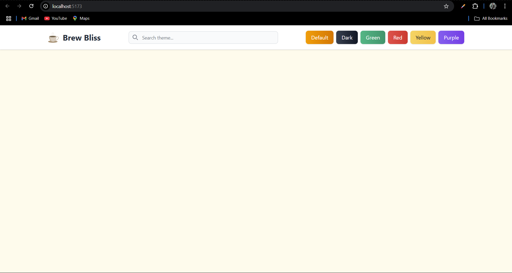
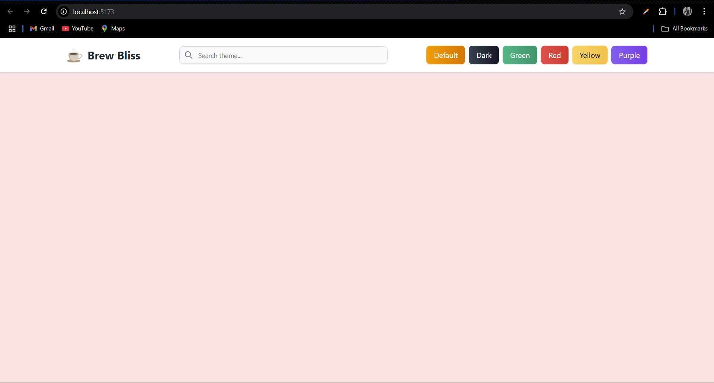
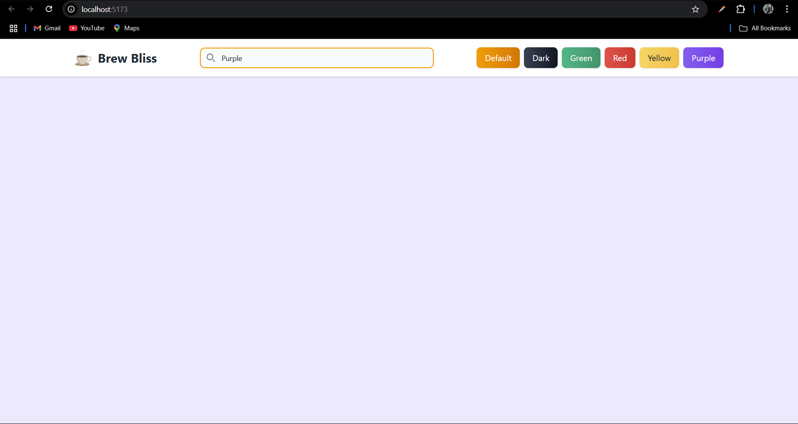

# 🎨 Background Changer App

This is a **React.js app** (built with **Vite**) that allows users to change the background color dynamically using **theme buttons** or by **searching for a color**. It is designed with **Tailwind CSS** for a modern and professional look.

---

## 🚀 Tech Stack

- ⚛️ React.js (with Vite)
- 🎨 Tailwind CSS
- 📄 HTML5 (index template)
- ⚡ JavaScript (ES6+)

---

## 📸 Screenshots

| Default Theme | Red Theme | Search Color |
|---------------|------------|---------------|
|  |  |  |

---

## ✨ Features

- ✅ Change background theme using **theme buttons**  
- ✅ **Search for any color** and apply it instantly  
- ✅ Smooth background transitions with Tailwind  
- ✅ Responsive navbar with logo, search, and theme switcher  
- ✅ Premium look with gradient buttons and shadows  

---

## 📁 Project Structure

```text
Bg-Changer-App/
│
├── public/                   # Static assets (icons, screenshots, etc.)
│   ├── default.png
│   ├── red.png
│   └── search.png
│
├── src/                      # React source code
│   ├── App.jsx               # Main app component
│   ├── main.jsx              # Entry point
│   └── index.css             # Tailwind CSS base styles
│
├── index.html                # Entry point HTML
├── package.json              # Project config and dependencies
├── tailwind.config.js        # Tailwind configuration
├── vite.config.js            # Vite configuration
└── .gitignore                # Ignored files and folders

```


## 🔧 How to Run Locally
Clone the repo and install dependencies:
```
git clone https://github.com/your-username/Bg-Changer-App.git
cd Bg-Changer-App
npm install
npm run dev

Then open: http://localhost:5173
```

## 🖱️ How It Works
Use the theme buttons (Default, Dark, Green, Red, Yellow, Purple) to switch themes.

Use the search bar to type a valid CSS color name or HEX code → press Enter → background updates instantly.

All transitions are smooth thanks to Tailwind’s utility classes.

## 📃 License  
This project is open-source under the [MIT License](../LICENSE).

## 🙋‍♂️ Author  

**Smit Garala**  
Full Stack Developer  

📧 Email: [smeetgarala6606@gmail.com](mailto:smeetgarala6606@gmail.com)  
🔗 [LinkedIn](https://www.linkedin.com/in/smit-garala-28956b344/)  
💻 [GitHub](https://github.com/smit6606)  
