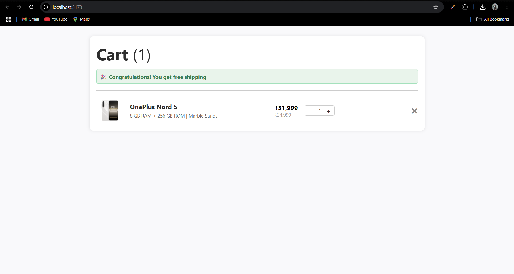
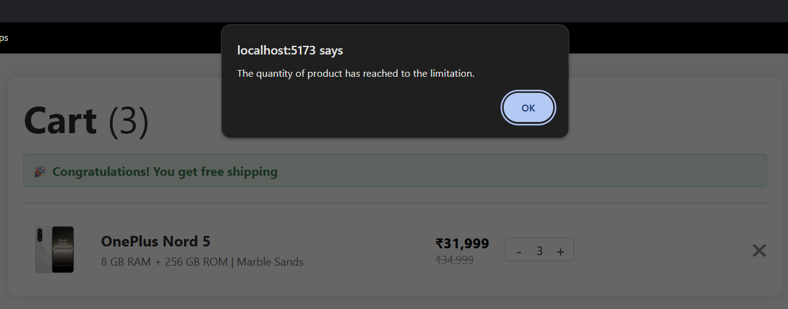

# 🛒 OnePlus Cart Counter

A minimal, professional React + Vite application that replicates the **OnePlus product cart experience**, featuring real-time quantity controls, product removal, and professional UI styling.

---

## 📸 Screenshots

| 🛒 Cart Preview                            |
| ------------------------------------------ |
|  |

| ⚠️ Max Limit Alert                               |
| ------------------------------------------------ |
|  |

---

## 🚀 Features

- 🧮 Quantity counter with **max limit of 3**
- ➖ Decrease disabled at **1 item**
- ⚠️ Alert shown when trying to exceed 3 items
- ❌ Remove product from cart
- 🎉 Free shipping message if item is in cart
- 🖥️ OnePlus-inspired professional UI (CSS only, no framework)

---

## 🏗️ Folder Structure

```
OnePlus-Cart-Counter/
├── public/
│   └── images/
│       └── oneplus-nord-5.png
│
├── src/
│   ├── components/
│   │   └── CartItem.jsx
│   ├── context/
│   │   └── CartContext.jsx
│   ├── App.jsx
│   ├── App.css
│   └── main.jsx
│
├── .gitignore
├── package.json
├── vite.config.js
└── README.md
```

---

## ⚙️ Tech Stack

- [React](https://react.dev/)
- [Vite](https://vitejs.dev/)
- Context API (for global state)
- Plain CSS (OnePlus-like layout)

---

## 🧑‍💻 Setup Instructions

1. Clone the repository:

```bash
git clone https://github.com/your-username/OnePlus-Cart-Counter.git
cd OnePlus-Cart-Counter
```

2. Install dependencies:

```bash
npm install
```

3. Run the app:

```bash
npm run dev
```

Open browser at: [http://localhost:5173](http://localhost:5173)

---

## 🔮 Future Enhancements

- Support for multiple products
- Add to cart from product page
- Local storage support
- Backend integration (Node/MongoDB or Firebase)
- Unit testing with Jest/Vitest

---

## 📄 License

Licensed under the [MIT License](LICENSE).

---

> Designed & Developed with ❤️ to clone OnePlus UX by Smit
