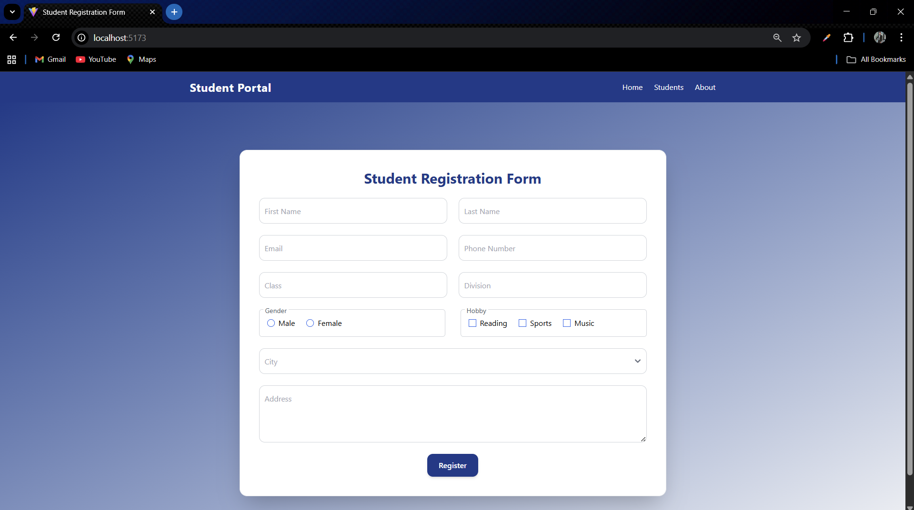
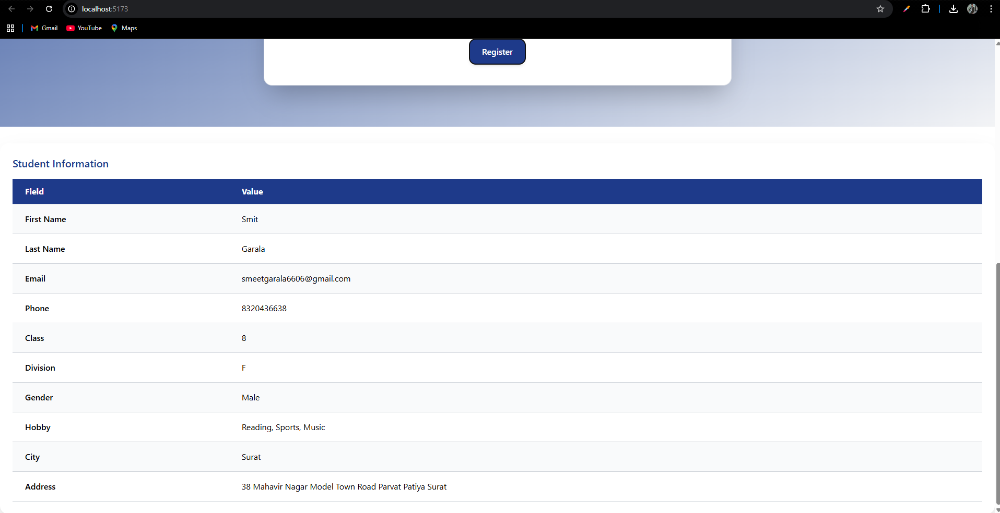

# 🎓 Students App

A modern **React + TypeScript** project built with **Vite** and styled using **TailwindCSS**.
This app contains a **Student Registration Form** with validation, city dropdown, gender & hobbies selection, and a clean responsive UI.

---

## 📂 Project Structure

```

Students-App/
│── node_modules/           # Installed dependencies
│── public/                 # Static assets (favicon, images, etc.)
│
│── src/
│ ├── assets/               # Project images, logos, etc.
│ ├── components/           # Reusable UI components
│ │ ├── navbar.tsx
│ │ └── studentForm.tsx
│ ├── App.tsx               # Root component
│ ├── index.css             # Global styles
│ ├── main.tsx              # App entry point
│ └── vite-env.d.ts         # Vite environment types
│
│── .gitignore
│── eslint.config.js        # ESLint configuration
│── index.html              # Main HTML file
│── package.json            # Project metadata & dependencies
│── package-lock.json
│── README.md               # Documentation
│── tsconfig.json           # TypeScript configuration
│── tsconfig.app.json
│── tsconfig.node.json
│── vite.config.ts          # Vite configuration

```

---

## 🚀 Features

- ✅ Built with **React + TypeScript**
- 🎨 Styled with **TailwindCSS**
- 📱 Fully responsive UI
- ✨ Clean form design with validations
- 📂 Modular and maintainable folder structure
- ⚡ Powered by **Vite** for fast development

---

## 📸 Preview

| Student Registration Form       | Form Submission                     | Table Output                       |
| ------------------------------- | ----------------------------------- | ---------------------------------- |
|  |  |  |


---

## 🛠️ Installation & Setup

Follow these steps to run the project locally:

```bash
# 1️⃣ Clone the repository
git clone https://github.com/your-username/student-form.git

# 2️⃣ Navigate to project folder
cd student-form

# 3️⃣ Install dependencies
npm install

# 4️⃣ Start development server
npm run dev
The app will be running at: http://localhost:5173/

```

---

## 📦 Dependencies

React (UI Library)

TypeScript (Static typing)

TailwindCSS (Styling)

Vite (Build tool)

---

## 📑 License

This project is licensed under the [MIT License](../LICENSE).

---

## ✨ Author

**👤 Smit Garala**  
🚀 Full-Stack Developer

- 💻 Expertise: React | Node.js | TypeScript
- 📬 Email: smeetgarala6606@gmail.com
- 🐙 GitHub: [smit6606](https://github.com/smit6606)
- 💼 LinkedIn: [Smit Garala](https://www.linkedin.com/in/smit-garala-28956b344/)

---
