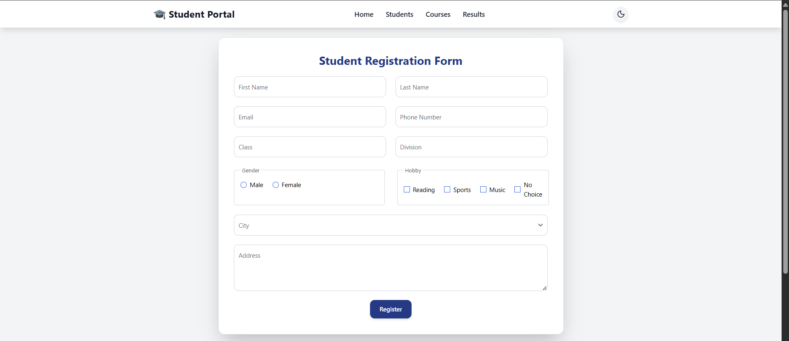
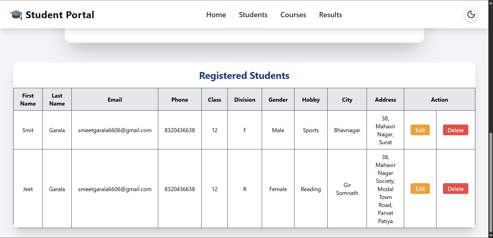
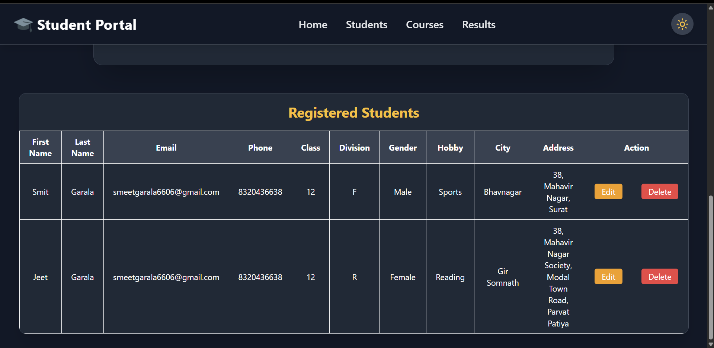
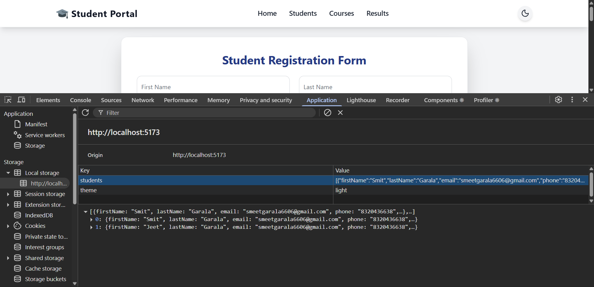

# 🎓 Students-App

A modern **React + TypeScript** student registration demo built with **Vite** and styled using **Tailwind CSS**. The app demonstrates a clean responsive form UI with validations, localStorage persistence for registered students, a theme toggle (light/dark), and a responsive data table with actions.

---

## 🔖 Quick summary

* **Stack:** React + TypeScript, Vite, Tailwind CSS
* **Features:** form validation, live validation after first submit, theme toggle (light/dark), persist students to `localStorage`, editable table with **Edit** and **Delete** actions hooks.

---

## 📁 Project structure

```
Students-App/
├─ node_modules/
├─ public/                  # static assets
│  ├─ form-ui.png
│  └─ table-output.png
├─ src/
│  ├─ assets/               # project images 
│  │  ├─ navbar.tsx
│  │  └─ studentForm.tsx
│  ├─ App.tsx
│  ├─ main.tsx
│  └─ index.css
├─ .gitignore
├─ index.html
├─ package.json
├─ tsconfig.json
├─ vite.config.ts
└─ README.md
```

---

## ✨ Features

* Responsive registration form with floating labels
* Validation rules:

  * First / Last name: 2–10 letters
  * Email: standard email format
  * Phone: 10 digits starting 6–9 (repeated-digit guard)
  * Class: numeric 1–12
  * Division: single uppercase A–Z
  * Hobby: at least one (or `No Choice`)
  * Address: 10–200 characters (letters, numbers, commas, slashes)
  * City: required selection
* Form shows errors for all fields after the first submit attempt.
* After the first submit, fields validate live while user types and errors disappear as inputs become valid.
* Registered students are saved to `localStorage` and displayed in a theme-matching table.
* Table includes **Edit** and **Delete** action buttons (UI ready)
* Light / Dark theme toggle implemented in the navbar

---

## 📸 Screenshots

Place screenshots in the `public/` folder and reference them below (or adjust the paths to your location):

|                     Form (light) | Form (dark)                                |
| -------------------------------: | :----------------------------------------- |
|  |  |

|                              Table (light) | Table (dark)                                         |
| -----------------------------------------: | :--------------------------------------------------- |
|  |  |

|                     Form + Table | Local Storage View                       |
| -------------------------------: | :--------------------------------------- |
|  |  |


---

## 🚀 Getting started (run locally)

Make sure you have Node.js (v16+) and npm installed.

```bash
# 1. clone the repo
git clone https://github.com/your-username/Students-App.git
cd Students-App

# 2. install dependencies
npm install

# 3. run dev server
npm run dev

# open http://localhost:5173
```

Common npm scripts (from `package.json`):

* `npm run dev` — start Vite dev server
* `npm run build` — build for production
* `npm run preview` — locally preview the production build

---

## ⚙️ How the validation flow works (short)

1. On the first submit attempt, the form validates all fields and displays errors for every invalid input.
2. After that first submit, the app enables "live" validation for each field — as the user types valid input the corresponding error is removed immediately.
3. This keeps the UX friendly while still forcing the user to fix all fields before data is accepted.

---

## 🧾 License

This project is licensed under the [MIT License](https://opensource.org/licenses/MIT)

---

## 👤 Author


**👤 Smit Garala**  
🚀 Full-Stack Developer

- 💻 Expertise: React | Node.js | TypeScript
- 📬 Email: smeetgarala6606@gmail.com
- 🐙 GitHub: [smit6606](https://github.com/smit6606)
- 💼 LinkedIn: [Smit Garala](https://www.linkedin.com/in/smit-garala-28956b344/)


---